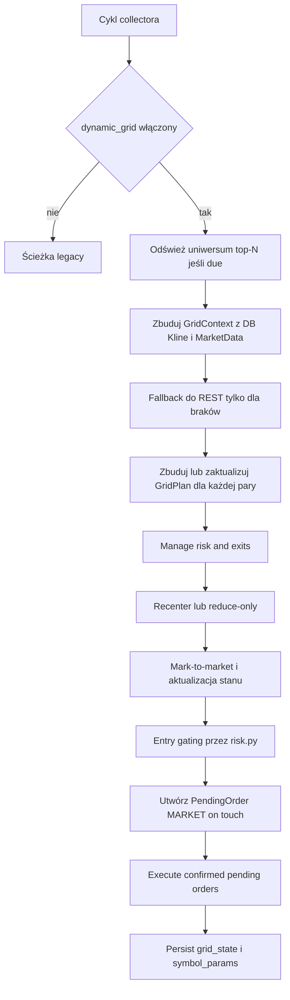

# Dynamiczny system dynamic_grid dla RLdC_AiNalyzator

## Podsumowanie wykonawcze

Najbardziej spójna droga dla `RLdC_AiNalyzator` to nie dokładanie kolejnych heurystyk do obecnej strategii `default`, tylko wprowadzenie nowego silnika `dynamic_grid`, który działa na **top-N parach Binance z kwotowaniem USDC**, samodzielnie dobiera uniwersum, sam wyznacza zakres grida, sam przelicza liczbę poziomów i wielkość ekspozycji, a następnie **najpierw egzekwuje ryzyko i wyjścia, dopiero później otwiera nowe wejścia**. Taki kierunek dobrze pasuje do obecnej architektury repo: `collector.py` już utrzymuje `watchlist`, ładuje i utrwala `symbol_params`, prowadzi mark-to-market pozycji, egzekuuje `PendingOrder`, a `runtime_settings.py` i `risk.py` dostarczają gotowy mechanizm runtime-config i bramek ryzyka. citeturn23view0turn29view1turn30view0turn36view1turn36view2turn7view4turn7view5

Kluczowe ograniczenie integracyjne jest bardzo konkretne: obecna ścieżka wykonawcza odpala w praktyce **automatycznie potwierdzane zlecenia market**, a nie natywnie utrzymywane limity grida na giełdzie. `_create_pending_order()` zapisuje `order_type="MARKET"` i auto-potwierdza zlecenia, a `_execute_confirmed_pending_orders()` wykonuje je następnie przez `place_order(..., order_type="MARKET")` dla trybu live. To oznacza, że pierwsza wersja `dynamic_grid` powinna być wdrożona jako **„logical grid / market-on-touch”**, czyli grid logiki i triggerów cenowych, a nie jako wielu aktywnych zleceń limit na Binance. Taka wersja minimalizuje zakres zmian, mieści się w obecnym flow repo i redukuje ryzyko problemów z liczbą niezamkniętych zleceń oraz zarządzaniem cancel/replace. citeturn37view5turn7view2turn49view0

Najważniejsze znalezisko architektoniczne jest też krytyczne z punktu widzenia bezpieczeństwa: obecne `risk.py` poprawnie liczy dzienny drawdown dla demo i live, ale **relacje ekspozycji** (`total_exposure_ratio`, `symbol_exposure_ratio`) są liczone wprost do `DEMO_INITIAL_BALANCE` tylko dla trybu demo; dla live `initial_balance` przechodzi na `0.0`, przez co te ratio stają się zerowe i bramki ekspozycji w live wyglądają na praktycznie nieaktywne. W dynamicznym gridzie trzeba to naprawić przed uruchomieniem realnego handlu wieloma parami. citeturn18view0turn18view2turn18view4turn19view1

W praktyce rekomenduję więc pięć decyzji projektowych. Po pierwsze, uniwersum powinno być wybierane dynamicznie z Binance co około pięć minut, bo `GET /api/v3/ticker/24hr` dla wszystkich symboli kosztuje wagę 80 i jest naturalnym źródłem do 24h ruchu, płynności i liczby transakcji. Po drugie, plan grida dla każdej aktywnej pary powinien być przeliczany **co każdy cykl collectora**; obecny collector domyślnie pracuje co 60 sekund. Po trzecie, wszystkie konstrukcje muszą być **relatywne**: ATR%, VWAP, EMA, spread, percentyle bar-range i percentyle ADX — bez `if symbol == "BTCUSDC"` i bez stałych „dla BTC”. Po czwarte, runtime ma utrwalać zarówno stan grida, jak i strojenie per symbol w `RuntimeSetting`, bo ten mechanizm już istnieje i jest używany przez repo. Po piąte, manualny override watchlisty z runtime powinien zachować najwyższy priorytet jako bezpiecznik operatorski. citeturn26view0turn29view4turn23view0turn35view1turn36view1turn36view2

## Wymagania i ograniczenia integracyjne

W obecnym stanie `DataCollector` inicjalizuje `watchlist` z `_load_watchlist()`, odświeża ją z interwałem `WATCHLIST_REFRESH_SECONDS` domyślnie równym 900 sekund, a przy zmianie listy potrafi zrestartować WebSockety. Jednocześnie lista jest budowana przede wszystkim **na podstawie aktywów w portfelu Binance**, a dopiero w fallbacku z `WATCHLIST` z `.env`. To jest fundamentalnie niezgodne z wymaganiem „top-N par USDC z rynku”, więc `dynamic_grid` musi przejąć kontrolę nad `collector.watchlist` i nie polegać na watchliście portfelowej. citeturn7view0turn7view1turn17view5turn37view5

Kolejna ważna rzecz: collector domyślnie zbiera `KLINE_TIMEFRAMES="1m,1h"`. Dla dynamicznego grida to za mało, bo sensowny builder zakresu i recenteringu powinien mieć co najmniej **szybki interwał 15m**, **kotwicę 1h** i **filtr trendu 4h**. To oznacza, że wymaganie implementacyjne powinno wprost obejmować zmianę domyślnego koszyka świec do `1m,15m,1h,4h` albo `15m,1h,4h`, zależnie od tego, czy 1m jest jeszcze potrzebne innym częściom systemu. citeturn29view4turn44view1

Repo ma już przydatny mechanizm pamięci per symbol. `collector.py` ładuje `self.symbol_params` z `RuntimeSetting` pod kluczem `learning_symbol_params`, a `runtime_settings.py` ma gotowe funkcje budowania runtime-state i upsertowania override’ów do `RuntimeSetting`. To oznacza, że nie trzeba od razu dodawać nowej tabeli bazy. Dla pierwszej produkcyjnej wersji wystarczy utrwalać dwie rzeczy: **stan grida** i **dynamiczne parametry per symbol** właśnie w `RuntimeSetting`. citeturn23view0turn36view2turn36view1

Dobrą wiadomością jest też to, że obecna architektura tradingowa już ma właściwą kolejność działań. W `_demo_trading()` repo najpierw robi `self._check_exits(db, tc)`, potem sprawdza cele HOLD, następnie auto-ustawia TP/SL, rotuje kapitał, a **dopiero później** przechodzi do screeningu nowych wejść. Dynamiczny grid powinien zachować dokładnie tę filozofię: w każdej iteracji najpierw `manage_risk_and_exits()`, potem `recenter_if_needed()`, a na końcu `place_grid_entries()`. citeturn30view0

Trzeba też uczciwie zaznaczyć, czego nie udało mi się jednoznacznie potwierdzić w odczytanych fragmentach publicznego repo. Potwierdzone są wywołania `get_balances()`, `resolve_symbol()`, `get_allowed_symbols()`, `get_ticker_price()` i `place_order()`. Pełnej zawartości `backend/binance_client.py` nie udało się niezawodnie wyciągnąć przez publiczny fetch, więc metody takie jak `get_orderbook()`, `get_klines()` czy zbiorcze `get_24hr_tickers()` należy traktować jako **„zweryfikować lub dopisać”**. To nie blokuje projektu — przeciwnie, precyzuje patch-listę. citeturn17view3turn17view4turn17view5turn29view1turn7view2

Najpoważniejsze obecne ograniczenie bezpieczeństwa leży w `risk.py`. Funkcja `evaluate_risk()` poprawnie blokuje handel po kill-switchu, po drawdownie dziennym i po streaku strat, ale dla ekspozycji live używa konstrukcji, która sprowadza `total_exposure_ratio` i `symbol_exposure_ratio` do zera, bo bazę ekspozycji ustawia tylko dla demo. Dla systemu top-N gridów to zbyt duża luka. Naprawa tej logiki jest krytyczna, bo bez tego wiele par może równolegle zwiększać inventory risk poza zamierzonym limitem. citeturn18view0turn18view2turn18view4turn19view1

## Dane wejściowe i selekcja top-N

Najlepszy model danych dla `dynamic_grid` to układ **repo-first, REST-fallback**. Oznacza to: wskaźniki techniczne i percentyle liczyć z danych `Kline` już zapisanych w DB, a REST używać do okresowego wyboru uniwersum, weryfikacji spreadu i dogrania braków. To dobrze współgra z `analysis.py`, gdzie `get_live_context(db, symbol, timeframe, limit)` bierze świece z tabeli `Kline`, wymaga co najmniej 60 barów i zwraca między innymi EMA20, EMA50, RSI14, ATR14 oraz dynamiczne progi `rsi_buy` i `rsi_sell` liczone jako percentyle RSI. Ten sam moduł już liczy także ADX, rolling VWAP, volume ratio, Donchiana, MFI, OBV, Supertrend i inne wskaźniki, więc nie ma sensu duplikować tych obliczeń w innym miejscu. citeturn44view1turn42view0

Tabela poniżej porządkuje wejścia, które warto wykorzystać w pierwszej produkcyjnej wersji.

| Wejście | Źródło | Kluczowe pola | Uwagi implementacyjne |
|---|---|---|---|
| Uniwersum symboli spot | `GET /api/v3/exchangeInfo` | `symbols[]`, `baseAsset`, `quoteAsset`, `status`, `permissions`, `filters` | Filtrować `quoteAsset == USDC`, `status == TRADING`, `permissions` zawierające `SPOT`; z `filters` brać `PRICE_FILTER`, `LOT_SIZE`, `MIN_NOTIONAL`/`NOTIONAL`. Binance podaje wagę 20. citeturn27view0turn34view0 |
| Snapshot 24h | `GET /api/v3/ticker/24hr` | `priceChangePercent`, `highPrice`, `lowPrice`, `quoteVolume`, `count`, `bidPrice`, `askPrice`, `weightedAvgPrice` | Gdy `symbol` jest pominięty, endpoint zwraca wszystkie tickery i ma wagę 80; to naturalna baza do wyboru top-N. citeturn26view0 |
| Szybkie i wolne świece | `GET /api/v3/klines` lub tabela `Kline` | OHLCV, `quote asset volume`, `number of trades` | REST ma wagę 2; w repo lepiej czytać lokalne `Kline`, a REST stosować jako fallback. citeturn26view0turn44view1 |
| Mikrostruktura | `GET /api/v3/depth` | najlepszy bid/ask, głębokość | Dla limitu 1–100 waga wynosi 5; wystarczy do precyzyjnego spreadu i sanity-checku płynności. citeturn26view0 |
| Cena awaryjna | `MarketData` w DB, fallback `get_ticker_price()` | ostatnia cena | Collector już robi mark-to-market z DB i dopiero potem z fallbacku klienta Binance. citeturn29view1 |

Z czysto praktycznego punktu widzenia rekomenduję rozdzielenie dwóch częstotliwości. **Odświeżanie uniwersum top-N** powinno chodzić co 300 sekund, bo pełny `ticker/24hr` dla wszystkich symboli kosztuje 80 wag. **Odświeżanie planów gridu** powinno chodzić co cykl collectora, czyli domyślnie co 60 sekund, ale w idealnym wariancie wtedy prawie wszystko idzie z lokalnych tabel `Kline` i `MarketData`, a nie z REST. Dla 10 par daje to sensowny koszt odpytywania nawet przy awaryjnych REST-fallbackach, a przede wszystkim nie wprowadza nadmiernego opóźnienia w recenteringu. citeturn26view0turn29view4turn44view1

### Algorytm selekcji top-N

Selektor powinien przechodzić przez następujący pipeline:

1. wczytaj listę dozwolonych symboli `USDC` z `exchangeInfo` i dodatkowo z repozytoryjnego `get_allowed_symbols(quotes=["USDC"])`,  
2. odrzuć pary `stable-stable`,  
3. policz 24h range, spread i ATR%,  
4. zastosuj filtry płynnościowo-transakcyjne,  
5. policz skoring z wykorzystaniem z-score’ów,  
6. wybierz top `N`.

Wersja produkcyjna nie powinna opierać się na sztywnym minimum typu „5 mln USDC dla każdej pary”, tylko na filtrach relatywnych z bezpiecznym globalnym floorem. Dobry kompromis w praktyce to:

- `min_quote_volume_eff = max(min_quote_volume_abs, quantile(quoteVolume, q_vol))`
- `min_trade_count_eff = max(min_trade_count_abs, quantile(count, q_trades))`
- `max_spread_eff = min(max_spread_bps_cap, quantile(spread_bps, q_spread))`

gdzie `q_vol`, `q_trades` i `q_spread` są runtime-owymi parametrami, a nie stałymi per symbol. To nadal są **jedne zasady dla całego rynku USDC**, a nie tuning „dla BTC inaczej, dla DOGE inaczej”.

Proponowany skoring:

```text
range_24h_pct   = (highPrice - lowPrice) / max(lowPrice, eps)
abs_change_pct  = abs(priceChangePercent) / 100
spread_pct      = spread_bps / 10000
atr_pct_15m     = ATR14_15m / last_price

z_range   = zscore(winsorize(range_24h_pct))
z_change  = zscore(winsorize(abs_change_pct))
z_atr     = zscore(winsorize(atr_pct_15m))
z_volume  = zscore(log1p(quoteVolume))
z_trades  = zscore(log1p(count))
z_spread  = zscore(winsorize(spread_pct))

score =
    0.30 * z_range
  + 0.25 * z_change
  + 0.20 * z_atr
  + 0.15 * z_volume
  + 0.10 * z_trades
  - 0.20 * max(z_spread, 0)
```

Ten skoring preferuje realny ruch i realną zdolność do „pracowania” w gridzie, a nie wyłącznie nominalny wolumen. W praktyce oznacza to, że bardzo płynna, ale mało ruchliwa para nie wygra z parą nieco mniej płynną, ale o zdecydowanie lepszej amplitudzie i ATR. Równocześnie ujemna kara za spread zabezpiecza przed doborem par, które wyglądają dobrze na 24h tickerze, ale są kosztowne transakcyjnie. Dane do takiego rankingu są bezpośrednio dostępne z `ticker/24hr`, `depth`, `klines` i `exchangeInfo`. citeturn26view0turn27view0turn34view0

Stable-stable należy wycinać deterministycznie, ponieważ tam sama natura instrumentu niszczy sens zmiennościowego grida. W praktyce wystarczy lista bazowych stable assetów utrzymywana centralnie, na przykład `{"USDC","USDT","FDUSD","TUSD","BUSD","DAI","EUR","EURI","USD1"}`. To nie jest „per-symbol tuning”, tylko techniczne wykluczenie klas instrumentów, które nie spełniają celu strategii.

Poniższy szkic funkcji jest zgodny z powyższą logiką i z ideą przejmowania `collector.watchlist` przez dynamiczny selektor.

```python
from __future__ import annotations

from dataclasses import dataclass
from math import log1p
from statistics import mean, pstdev
from typing import Iterable

STABLE_BASES = {"USDC", "USDT", "FDUSD", "TUSD", "BUSD", "DAI", "USD1", "EUR", "EURI"}

@dataclass(frozen=True)
class PairFeatures:
    symbol: str
    quote_volume: float
    trade_count: int
    range_24h_pct: float
    abs_change_pct: float
    spread_bps: float
    atr_pct_15m: float
    last_price: float

def zscore(value: float, values: Iterable[float]) -> float:
    vals = list(values)
    if len(vals) < 2:
        return 0.0
    sd = pstdev(vals)
    if sd <= 1e-12:
        return 0.0
    return (value - mean(vals)) / sd

def select_top_usdc_pairs(
    rows: list[PairFeatures],
    *,
    top_n: int,
    min_quote_volume_eff: float,
    min_trade_count_eff: int,
    max_spread_eff_bps: float,
) -> list[PairFeatures]:
    eligible = [
        r for r in rows
        if r.symbol.endswith("USDC")
        and r.symbol[:-4] not in STABLE_BASES
        and r.quote_volume >= min_quote_volume_eff
        and r.trade_count >= min_trade_count_eff
        and r.spread_bps <= max_spread_eff_bps
        and r.last_price > 0
    ]

    if not eligible:
        return []

    xs_range  = [r.range_24h_pct for r in eligible]
    xs_change = [r.abs_change_pct for r in eligible]
    xs_atr    = [r.atr_pct_15m for r in eligible]
    xs_vol    = [log1p(r.quote_volume) for r in eligible]
    xs_count  = [log1p(r.trade_count) for r in eligible]
    xs_spread = [r.spread_bps / 10000.0 for r in eligible]

    def score(r: PairFeatures) -> float:
        z_range  = zscore(r.range_24h_pct, xs_range)
        z_change = zscore(r.abs_change_pct, xs_change)
        z_atr    = zscore(r.atr_pct_15m, xs_atr)
        z_vol    = zscore(log1p(r.quote_volume), xs_vol)
        z_count  = zscore(log1p(r.trade_count), xs_count)
        z_spread = zscore(r.spread_bps / 10000.0, xs_spread)

        return (
            0.30 * z_range
            + 0.25 * z_change
            + 0.20 * z_atr
            + 0.15 * z_vol
            + 0.10 * z_count
            - 0.20 * max(z_spread, 0.0)
        )

    return sorted(eligible, key=score, reverse=True)[:top_n]
```

## Budowa gridu, recentering i reguły wykonania

Najmocniejszym argumentem za implementacją buildera grida w samym repo jest to, że `analysis.py` już liczy większość potrzebnych wskaźników. Z dostępnych fragmentów widać EMA20, EMA50, RSI14, ATR14, MACD, Bollingery, ADX, volume ratio, rolling VWAP, Donchiana, MFI, OBV, Supertrend i squeeze, a `get_live_context()` zwraca już dynamiczny kontekst oparty o `Kline` z bazy. W praktyce najlepszym ruchem jest więc dodanie nowej funkcji pomocniczej, na przykład `get_grid_context()`, zamiast budowania drugiego, równoległego silnika analitycznego. citeturn42view0turn44view1

### Kontekst wejściowy dla buildera grida

Builder powinien dostać ustandaryzowany `GridContext` z trzech warstw czasu:

- **15m**: szybka zmienność i spacing poziomów,
- **1h**: główna kotwica zakresu i VWAP do centru,
- **4h**: filtr strukturalnego trendu.

Jeżeli w DB brakuje danych:

- przy braku `<60` barów dla 15m/1h/4h: jednorazowy REST fallback po `klines`,
- przy braku `depth`: fallback do `bidPrice/askPrice` z `ticker/24hr FULL`,
- przy braku `exchangeInfo` / filtrów symbolu: symbol przechodzi w tryb `read_only` albo jest pomijany,
- przy braku wszystkich danych jakościowych: **brak handlu na symbolu**; nie wolno zmyślać zakresu.

To podejście jest spójne z repo: `get_live_context()` już zwraca `None`, gdy ma za mało historii, a `mark-to-market` w collectorze też robi bezpieczny fallback ceny z `MarketData` do `get_ticker_price()`. citeturn44view1turn29view1

### W pełni relatywny builder planu grida

Poniżej znajduje się projekt produkcyjnego buildera bez stałych „dla BTC”. Wszystkie parametry zależą od relatywnej zmienności, spreadu, trendu i percentyli z własnej historii danej pary.

Definicje pomocnicze:

```text
p               = last_price
atr15_pct       = ATR14_15m / p
atr1h_pct       = ATR14_1h / p
ema20_15        = EMA20_15m
ema50_15        = EMA50_15m
ema20_1h        = EMA20_1h
ema50_1h        = EMA50_1h
adx1h           = ADX14_1h
vwap24h         = rolling_vwap(1h, 24 bars)
spread_pct      = spread_bps / 10000

range_bar_pct_t = (high_t - low_t) / close_t    # 15m
q50_range       = percentile(range_bar_pct, 0.50)
q80_range       = percentile(range_bar_pct, 0.80)
q95_range       = percentile(range_bar_pct, 0.95)

atr_hist_med    = median(atr15_pct_history)
vol_regime      = clip(atr15_pct / max(atr_hist_med, eps), 0.50, 2.50)
```

**Centrum zakresu**

```text
trend_bias_raw =
    0.50 * ((ema20_15 / ema50_15) - 1.0)
  + 0.50 * ((ema20_1h / ema50_1h) - 1.0)

trend_bias =
    clip(trend_bias_raw / max(atr15_pct, eps), -1.0, 1.0)

base_anchor =
    0.45 * p
  + 0.25 * ema20_15
  + 0.20 * ema20_1h
  + 0.10 * vwap24h

center =
    base_anchor * (1.0 + 0.35 * trend_bias * atr15_pct)
```

Ta konstrukcja jest istotna: centrum nie siedzi ślepo w ostatniej cenie, ale też nie próbuje „przewidywać” rynku. Kotwiczy się między ceną, średnimi i VWAP, a przesunięcie trendowe jest ograniczone przez bieżącą ATR%.

**Połowa szerokości zakresu**

```text
adx_hist_q80 = percentile(adx1h_history, 0.80)  # fallback: runtime min_adx_for_entry
adx_norm     = clip(adx1h / max(adx_hist_q80, eps), 0.50, 1.50)

width_mult =
    clip(2.20 * vol_regime + 0.40 * adx_norm, 1.80, 5.50)

half_width_pct_raw =
    max(
        width_mult * atr15_pct,
        q80_range,
        3.0 * spread_pct
    )

half_width_pct =
    clip(
        half_width_pct_raw,
        q50_range * 1.20,
        q95_range * 1.10
    )

lower = center * (1.0 - half_width_pct)
upper = center * (1.0 + half_width_pct)
```

Zakres przestaje być „manualnym pudełkiem”. Wąskie pary dostają węższy grid, agresywne pary — szerszy. Spread pilnuje, żeby grid nie był absurdalnie drobny względem kosztu wejścia/wyjścia.

**Krok i liczba gridów**

```text
step_pct_raw =
    max(
        0.55 * atr15_pct,
        2.50 * spread_pct,
        0.45 * q50_range
    )

step_pct =
    clip(
        step_pct_raw,
        (2.0 * half_width_pct) / max_grids,
        (2.0 * half_width_pct) / min_grids
    )

grid_count =
    clip(
        round((2.0 * half_width_pct) / max(step_pct, eps)),
        min_grids,
        max_grids
    )
```

Dla krypto lepszy jest **grid geometryczny**, nie liniowy. Poziomy:

```text
log_step = ln(1 + step_pct)

buy_i  = center * exp(-i * log_step)
sell_i = center * exp(+i * log_step)
```

po czym każdy poziom trzeba przyciąć do `[lower, upper]` i zaokrąglić do `tickSize`.

**Wielkość inwestycji i ekspozycja**

```text
liq_bonus   = clip(z_quote_volume / 4.0, -0.20, 0.20)
vol_pen     = clip(vol_regime - 1.0, 0.0, 1.50)
spread_pen  = clip(spread_pct / max(max_spread_eff_pct, eps), 0.0, 1.50)
trend_pen   = 1.0 if (ema20_1h < ema50_1h and adx1h_is_strong) else 0.0

risk_multiplier =
    clip(
        1.00 + liq_bonus - 0.20 * vol_pen - 0.20 * spread_pen - 0.20 * trend_pen,
        0.30,
        1.00
    )

invest_pct =
    min(
        base_invest_pct * risk_multiplier,
        max_symbol_exposure_pct - current_symbol_exposure_pct,
        max_total_exposure_pct - current_total_exposure_pct
    )

invest_pct = max(invest_pct, 0.0)
invest_quote = equity * invest_pct
```

Nie ma tu żadnego „BTC ma 10x większą pozycję”. Jedynym czynnikiem jest bieżąca jakość rynku i własna historia symbolu.

**Hard stop i strefa ochronna**

```text
stop_pad_pct =
    max(
        0.35 * atr15_pct,
        1.50 * spread_pct
    )

hard_stop = lower * (1.0 - stop_pad_pct)
```

To jest twardy bezpiecznik. Jeśli rynek wyjdzie istotnie pod zakres, grid nie może „dobierać na ślepo”.

Poniższy szkic funkcji pokazuje, jak taki builder może wyglądać od strony kodu.

```python
from __future__ import annotations

from dataclasses import dataclass
from math import exp, log

@dataclass
class GridPlan:
    symbol: str
    center: float
    lower: float
    upper: float
    half_width_pct: float
    step_pct: float
    grid_count: int
    invest_pct: float
    invest_quote: float
    hard_stop: float
    risk_multiplier: float
    buy_levels: list[float]
    sell_levels: list[float]

def clip(x: float, lo: float, hi: float) -> float:
    return max(lo, min(hi, x))

def build_grid_plan(ctx: dict, cfg: dict, equity: float) -> GridPlan:
    p = float(ctx["last_price"])
    atr15_pct = float(ctx["atr15_pct"])
    ema20_15 = float(ctx["ema20_15"])
    ema50_15 = float(ctx["ema50_15"])
    ema20_1h = float(ctx["ema20_1h"])
    ema50_1h = float(ctx["ema50_1h"])
    vwap24h = float(ctx["vwap24h"])
    adx_norm = float(ctx["adx_norm"])
    q50_range = float(ctx["q50_range"])
    q80_range = float(ctx["q80_range"])
    q95_range = float(ctx["q95_range"])
    spread_pct = float(ctx["spread_bps"]) / 10000.0
    vol_regime = float(ctx["vol_regime"])

    trend_bias_raw = (
        0.50 * ((ema20_15 / max(ema50_15, 1e-12)) - 1.0)
        + 0.50 * ((ema20_1h / max(ema50_1h, 1e-12)) - 1.0)
    )
    trend_bias = clip(trend_bias_raw / max(atr15_pct, 1e-9), -1.0, 1.0)

    base_anchor = 0.45 * p + 0.25 * ema20_15 + 0.20 * ema20_1h + 0.10 * vwap24h
    center = base_anchor * (1.0 + 0.35 * trend_bias * atr15_pct)

    width_mult = clip(2.20 * vol_regime + 0.40 * adx_norm, 1.80, 5.50)
    half_width_pct = max(width_mult * atr15_pct, q80_range, 3.0 * spread_pct)
    half_width_pct = clip(half_width_pct, q50_range * 1.20, q95_range * 1.10)

    lower = center * (1.0 - half_width_pct)
    upper = center * (1.0 + half_width_pct)

    min_grids = int(cfg["dynamic_grid_min_grids"])
    max_grids = int(cfg["dynamic_grid_max_grids"])

    step_pct_raw = max(0.55 * atr15_pct, 2.50 * spread_pct, 0.45 * q50_range)
    step_pct = clip(step_pct_raw, (2.0 * half_width_pct) / max_grids, (2.0 * half_width_pct) / min_grids)
    grid_count = int(clip(round((2.0 * half_width_pct) / max(step_pct, 1e-9)), min_grids, max_grids))

    risk_multiplier = float(ctx["risk_multiplier"])
    invest_pct = float(cfg["dynamic_grid_base_invest_pct"]) * risk_multiplier
    invest_pct = clip(invest_pct, 0.0, float(cfg["dynamic_grid_max_symbol_exposure_pct"]))
    invest_quote = equity * invest_pct

    stop_pad_pct = max(0.35 * atr15_pct, 1.50 * spread_pct)
    hard_stop = lower * (1.0 - stop_pad_pct)

    half_levels = max(1, grid_count // 2)
    log_step = log(1.0 + step_pct)
    buy_levels = [max(lower, center * exp(-i * log_step)) for i in range(1, half_levels + 1)]
    sell_levels = [min(upper, center * exp(+i * log_step)) for i in range(1, half_levels + 1)]

    return GridPlan(
        symbol=ctx["symbol"],
        center=center,
        lower=lower,
        upper=upper,
        half_width_pct=half_width_pct,
        step_pct=step_pct,
        grid_count=grid_count,
        invest_pct=invest_pct,
        invest_quote=invest_quote,
        hard_stop=hard_stop,
        risk_multiplier=risk_multiplier,
        buy_levels=buy_levels,
        sell_levels=sell_levels,
    )
```

### Recentering i blokowanie wejść

Najważniejszy parametr sterujący to:

```text
position_in_range = (p - lower) / max(upper - lower, eps)
```

oraz trzy stany trendu:

```text
strong_up   = ema20_15 > ema50_15 and ema20_1h > ema50_1h and adx1h >= max(min_adx_for_entry, q60_adx1h)
strong_down = ema20_15 < ema50_15 and ema20_1h < ema50_1h and adx1h >= max(min_adx_for_entry, q60_adx1h)
neutral     = not strong_up and not strong_down
```

Reguły sterowania powinny być jawne:

| Warunek | Akcja |
|---|---|
| `0.20 <= position_in_range <= 0.80` | brak recenteringu |
| `position_in_range > 0.88` i `strong_up` | przygotuj recenter w górę, jeśli nowy `center` różni się o co najmniej `recenter_atr_mult * ATR15` |
| `position_in_range < 0.18` i nie ma `strong_up` | zablokuj nowe BUY |
| `position_in_range < 0.10` i `strong_down` | `reduce_only=True`, redukuj inventory, bez nowych BUY |
| `p < lower - recenter_abort_atr_mult * ATR15` | awaryjny close lub wymuszone recenter po redukcji |
| `p < hard_stop` | zamknij pozycję, cooldown |

To jest dokładnie ten brakujący element, który odróżnia grid „ładnie wyglądający na ekranie” od gridu produkcyjnego. Grid nie może tylko przesuwać zasięgu; musi także umieć **przestać dokupować**, gdy jest przygnieciony przez trend spadkowy.

Repo obecnie ma execution path lepiej dopasowany do trybu `market_on_touch` niż do utrzymywania dziesiątek resting orderów. Dlatego pierwsza wersja powinna działać tak: plan grida generuje poziomy, a collector tworzy `PendingOrder` z `MARKET` dopiero wtedy, gdy cena dotknie poziomu i bramki ryzyka nadal przepuszczają transakcję. To zachowuje obecne modele `PendingOrder`, `Order`, `Position`, `ExitQuality` i ścieżkę `place_order()`. citeturn37view5turn7view2turn40view0turn23view2

## Ryzyko, bezpieczeństwo i monitoring

W gridzie spot najgroźniejsze nie jest pojedyncze złe wejście, tylko **akumulacja inventory risk**. Dlatego rdzeń ryzyka musi pracować na trzech poziomach: per-symbol, portfelowo i benchmarkowo. Repo ma już dobrą ramę do części portfelowej: `evaluate_risk()` potrafi blokować handel przez kill-switch, drawdown dzienny, streak strat, limity aktywności i expectancy/cost leakage. Tę warstwę trzeba zachować, ale rozszerzyć tak, aby liczyła ekspozycję live względem realnej bazy kapitałowej, a nie zera. citeturn7view5turn19view1

### Limity per symbol

Dla `dynamic_grid` proponuję nie przechowywać jednej „sztywnej” straty maksymalnej, tylko dynamiczny próg wyliczany z jakości rynku symbolu:

```text
max_grid_loss_pct_eff =
    clip(
        base_grid_loss_pct
        * (1.0 - 0.15 * spread_pen + 0.10 * liquidity_bonus - 0.10 * vol_pen),
        min_grid_loss_pct,
        max_grid_loss_pct
    )
```

Następnie warstwy reakcji:

| Poziom straty symbolu | Reakcja |
|---|---|
| `<= -0.50 * max_grid_loss_pct_eff` | `block_new_buys = True` |
| `<= -0.75 * max_grid_loss_pct_eff` | redukcja inventory o `dynamic_grid_reduce_fraction` |
| `<= -1.00 * max_grid_loss_pct_eff` | zamknięcie pozycji i cooldown |
| `price <= hard_stop` | bezwarunkowe zamknięcie i dłuższy cooldown |

To są progi **względne**; wszystkie wynikają z jednego, runtime-owego parametru bazowego.

### Limity portfelowe

Ekspozycja na symbol i na cały portfel ma być wyrażona jako procent equity. Obecny `risk.py` już ma runtime keys `max_total_exposure_ratio`, `max_symbol_exposure_ratio`, `max_daily_drawdown`, `loss_streak_limit`, `max_trades_per_day` i `max_trades_per_hour_per_symbol`, ale trzeba poprawić live-base dla ekspozycji. Równie ważne jest to, że grid engine powinien **proaktywnie** liczyć swoją ekspozycję przed call’em do `build_risk_context()`, zamiast liczyć wyłącznie na gate końcowy. citeturn20view2turn20view3turn20view6turn20view5turn18view2turn18view4turn19view1

Minimalna poprawka w `risk.py` powinna wyglądać tak koncepcyjnie:

```text
equity_base_live =
    max(
        latest_account_snapshot_equity,
        cfg.live_balance_quote,
        cfg.live_balance_eur_converted,
        rs.total_exposure
    )

total_exposure_ratio  = rs.total_exposure / equity_base_live
symbol_exposure_ratio = rs.exposure_per_symbol[symbol] / equity_base_live
```

Dopiero po tej poprawce `max_total_exposure_ratio` i `max_symbol_exposure_ratio` zaczną naprawdę działać w live.

### Globalne kill-switch’e bez stałych BTC

Ponieważ wymaganie brzmi „bez hard-coded BTC-based constants”, benchmark szoku rynkowego nie powinien brzmieć „jeśli BTC spadnie o 3%”. Zamiast tego:

- `benchmark_symbol` jest runtime-owym parametrem; jeśli nie jest ustawiony, system może dynamicznie wybrać **najbardziej płynną parę USDC** jako benchmark,
- próg szoku jest liczony **relatywnie** do własnej historii benchmarku.

Proponowana reguła:

```text
bench_ret_abs_15m = abs(log(bench_close_t / bench_close_t-1))
bench_shock_threshold =
    max(
        percentile(abs(bench_ret_15m_history), benchmark_shock_pctile),
        benchmark_shock_atr_mult * bench_atr15_pct
    )

if bench_ret_abs_15m > bench_shock_threshold:
    kill_switch_market_shock = True
```

Dodatkowe kill-switch’e powinny obejmować:

- `total_drawdown >= max_daily_drawdown`,
- `used_weight` / 429 / stale data / repeated REST failures,
- spread shock: `spread_bps > spread_p95 * spread_shock_mult`,
- brak świeżego `MarketData` lub `Kline`.

Repo ma już helper Telegramowy `_send_telegram_alert()`, więc alarmowanie można osadzić w istniejącej ścieżce logowania bez budowania nowej warstwy powiadomień. citeturn49view0turn37view5

Poniższy szkic pokazuje warstwę `manage_risk_and_exits()`.

```python
from __future__ import annotations

def manage_risk_and_exits(plan, state, market, cfg):
    price = float(market["last_price"])
    atr15 = float(market["atr15"])
    unrealized_loss_pct = float(state["unrealized_loss_pct"])
    position_qty = float(state["position_qty"])

    block_frac = float(cfg["dynamic_grid_block_buys_frac"])
    reduce_frac = float(cfg["dynamic_grid_reduce_loss_frac"])
    close_frac = float(cfg["dynamic_grid_close_loss_frac"])

    max_grid_loss_pct_eff = float(state["max_grid_loss_pct_eff"])
    loss_block = -block_frac * max_grid_loss_pct_eff
    loss_reduce = -reduce_frac * max_grid_loss_pct_eff
    loss_close = -close_frac * max_grid_loss_pct_eff

    actions = {
        "block_new_buys": False,
        "reduce_fraction": 0.0,
        "close_all": False,
        "cooldown_minutes": 0,
        "reason": "risk_ok",
    }

    if price <= plan.hard_stop:
        actions.update(
            close_all=True,
            block_new_buys=True,
            cooldown_minutes=int(cfg["dynamic_grid_hard_stop_cooldown_minutes"]),
            reason="hard_stop",
        )
        return actions

    if unrealized_loss_pct <= loss_close:
        actions.update(
            close_all=True,
            block_new_buys=True,
            cooldown_minutes=int(cfg["dynamic_grid_loss_cooldown_minutes"]),
            reason="grid_loss_close",
        )
        return actions

    if unrealized_loss_pct <= loss_reduce and position_qty > 0:
        actions.update(
            reduce_fraction=float(cfg["dynamic_grid_reduce_fraction"]),
            block_new_buys=True,
            reason="grid_loss_reduce",
        )
        return actions

    if unrealized_loss_pct <= loss_block:
        actions.update(
            block_new_buys=True,
            reason="grid_loss_block_buys",
        )
        return actions

    if price < (plan.lower - float(cfg["dynamic_grid_recenter_abort_atr_mult"]) * atr15):
        actions.update(
            block_new_buys=True,
            reason="below_range_abort_zone",
        )

    return actions
```

## Integracja, trwałość stanu, testy i przykładowe outputy

Najmniej inwazyjny plan wdrożenia wymaga zmian w kilku precyzyjnych plikach. `collector.py` musi dostać nowy cykl `dynamic_grid`. `analysis.py` powinno zwracać bogatszy `GridContext`. `runtime_settings.py` powinno expose’ować runtime variables dla gridu. `risk.py` trzeba poprawić dla live exposure ratios. `binance_client.py` trzeba zweryfikować i ewentualnie rozszerzyć o brakujące market-data helpers. Wszystko to można zrobić bez migracji DB, bo `RuntimeSetting` nadaje się do utrwalenia stanu, a taki wzorzec repo już stosuje dla `learning_symbol_params`. citeturn23view0turn36view2turn35view0turn36view1

### Dokładny plan patchy

| Plik | Zmiana | Status względem repo |
|---|---|---|
| `backend/collector.py` | dodać `self.grid_engine`, `_refresh_dynamic_grid_universe_if_due()`, `_dynamic_grid_cycle()`; przejąć `self.watchlist`; kolejność: risk/exits → recenter → entries → execution → persist | spójne z istniejącą orkiestracją i restartem WS po zmianie watchlisty. citeturn7view1turn30view0turn37view5 |
| `backend/analysis.py` | dodać `get_grid_context()` albo rozszerzyć `get_live_context()` o ADX, VWAP, volume ratio, percentyle range/ADX | repo już liczy te wskaźniki; trzeba je tylko udostępnić w jednym helperze. citeturn42view0turn44view1 |
| `backend/binance_client.py` | potwierdzić lub dodać `get_24hr_tickers()`, `get_orderbook()`, `get_klines()`, `get_exchange_info()`, helper roundowania po filtrach symbolu | pełna zawartość pliku nie została potwierdzona w odczytanych fragmentach; to obszar do explicit verification. |
| `backend/risk.py` | poprawić live-base dla ekspozycji; opcjonalnie dodać `evaluate_grid_risk()` | krytyczne przed live top-N. citeturn18view0turn18view4turn19view1 |
| `backend/runtime_settings.py` | dodać `SettingSpec` dla `TRADING_SYSTEM` i `DYNAMIC_GRID_*`; `enabled_strategies` rozszerzyć o `dynamic_grid` | styl repo już opiera się na `_SETTINGS` i `_cross_validate()`. citeturn35view0turn36view4 |
| `backend/strategies/dynamic_grid.py` | nowy silnik strategii | nowy plik |
| `tests/...` | testy selektora, buildera, ryzyka, trwałości stanu | nowy zestaw testów |

### Sygnatury funkcji

Minimalny, praktyczny zestaw:

```python
# backend/analysis.py
def get_grid_context(
    db: Session,
    symbol: str,
    *,
    fast_tf: str = "15m",
    anchor_tf: str = "1h",
    trend_tf: str = "4h",
    lookback: int = 240,
) -> Optional[dict]: ...

# backend/strategies/dynamic_grid.py
def select_top_usdc_pairs(binance, db: Session, cfg: dict) -> list[str]: ...
def build_grid_plan(symbol: str, ctx: dict, state: dict, cfg: dict, equity: float) -> GridPlan: ...
def manage_risk_and_exits(db: Session, plan: GridPlan, state: dict, cfg: dict, mode: str) -> dict: ...
def persist_state(db: Session, grid_state: dict, symbol_params: dict) -> None: ...
```

### Persistence przez RuntimeSetting

Najczystszy model to trzy klucze:

- `dynamic_grid_state` — pełny JSON planów i stanów,
- `dynamic_grid_symbol_params` — szybkie parametry per symbol do wczytywania przy starcie,
- `dynamic_grid_universe` — lista symboli, pomocna diagnostycznie.

`runtime_settings.upsert_overrides()` pokazuje, że `RuntimeSetting` i tak jest podstawowym magazynem runtime key/value, ale `build_runtime_state()` serializuje tylko klucze z `_SETTINGS`. Dlatego **stan strategii** lepiej trzymać jako oddzielne klucze techniczne, a nie wciskać na siłę do runtime-config sections. citeturn36view2turn20view7turn36view1

Przykładowy utrwalony `grid_state`:

```json
{
  "version": 3,
  "updated_at": "2026-05-18T09:20:00+02:00",
  "execution_mode": "market_on_touch",
  "universe": ["BTCUSDC", "ETHUSDC", "SOLUSDC", "XRPUSDC", "DOGEUSDC"],
  "benchmark_symbol": "BTCUSDC",
  "pairs": {
    "BTCUSDC": {
      "center": 77320.44,
      "lower": 74891.18,
      "upper": 79749.70,
      "half_width_pct": 0.0314,
      "step_pct": 0.0051,
      "grid_count": 12,
      "hard_stop": 74408.83,
      "block_new_buys": false,
      "reduce_only": false,
      "cooldown_until": null,
      "position_in_range": 0.41,
      "risk_multiplier": 0.91
    }
  }
}
```

Poniższy szkic pokazuje utrwalenie stanu w stylu zgodnym z repo.

```python
from __future__ import annotations

import json
from datetime import datetime

def persist_state(db, grid_state: dict, symbol_params: dict) -> None:
    from backend.database import RuntimeSetting, utc_now_naive

    now = utc_now_naive()

    payloads = {
        "dynamic_grid_state": json.dumps(grid_state, ensure_ascii=True, sort_keys=True),
        "dynamic_grid_symbol_params": json.dumps(symbol_params, ensure_ascii=True, sort_keys=True),
        "dynamic_grid_last_refresh_ts": now.isoformat(),
    }

    rows = {
        row.key: row
        for row in db.query(RuntimeSetting)
        .filter(RuntimeSetting.key.in_(list(payloads.keys())))
        .all()
    }

    for key, value in payloads.items():
        row = rows.get(key)
        if row is None:
            db.add(RuntimeSetting(key=key, value=value, updated_at=now))
        else:
            row.value = value
            row.updated_at = now

    db.commit()
```

### Kolejność pracy w runtime

Pętla strategii powinna wyglądać tak:



To zachowuje repozytoryjny styl „wyjścia przed wejściami”, a jednocześnie dodaje recentering jako pełnoprawny etap między ryzykiem a nowymi zleceniami. citeturn30view0turn37view5

### Runtime variables do wystawienia

Poniżej minimalny, praktyczny zestaw. Każda z tych zmiennych powinna dostać `SettingSpec` w `runtime_settings.py`, bo repo i tak już centralizuje config w `_SETTINGS`. citeturn35view0turn36view4

| Klucz | Rola |
|---|---|
| `TRADING_SYSTEM` | `default` albo `dynamic_grid` |
| `DYNAMIC_GRID_ENABLED` | twardy kill-switch modułu |
| `DYNAMIC_GRID_TOP_N` | liczba par w uniwersum |
| `DYNAMIC_GRID_UNIVERSE_REFRESH_SECONDS` | odświeżanie top-N |
| `DYNAMIC_GRID_PLAN_REFRESH_SECONDS` | odświeżanie planów grida |
| `DYNAMIC_GRID_MIN_GRIDS` / `DYNAMIC_GRID_MAX_GRIDS` | zakres liczby poziomów |
| `DYNAMIC_GRID_BASE_INVEST_PCT` | bazowy udział equity na symbol przed mnożnikiem ryzyka |
| `DYNAMIC_GRID_MAX_SYMBOL_EXPOSURE_PCT` | maks. ekspozycja symbolu |
| `DYNAMIC_GRID_MAX_TOTAL_EXPOSURE_PCT` | maks. ekspozycja portfela gridów |
| `DYNAMIC_GRID_BASE_GRID_LOSS_PCT` | bazowy próg straty symbolu |
| `DYNAMIC_GRID_BLOCK_BUYS_FRAC` / `DYNAMIC_GRID_REDUCE_LOSS_FRAC` / `DYNAMIC_GRID_CLOSE_LOSS_FRAC` | tiered loss actions |
| `DYNAMIC_GRID_REDUCE_FRACTION` | udział inventory do redukcji |
| `DYNAMIC_GRID_COOLDOWN_MINUTES` | cooldown po twardym wyjściu |
| `DYNAMIC_GRID_RECENTER_ATR_MULT` | minimalne przesunięcie centrum do recenteringu |
| `DYNAMIC_GRID_RECENTER_ABORT_ATR_MULT` | strefa awaryjna pod zakresem |
| `DYNAMIC_GRID_BENCHMARK_SYMBOL` | opcjonalny benchmark rynku |
| `DYNAMIC_GRID_EXECUTION_MODE` | `market_on_touch` lub przyszłe `resting_limit` |

### Plan testów i walidacji

Testy trzeba podzielić na trzy warstwy.

**Warstwa jednostkowa** powinna sprawdzać nie tyle „czy zwróciło jakąś wartość”, ile inwarianty systemu:

- selektor top-N nigdy nie przepuszcza `stable-stable`,
- builder zawsze zwraca `lower < center < upper`,
- `grid_count` zawsze mieści się w runtime bounds,
- `step_pct` nigdy nie jest mniejsze od spread floor,
- `invest_pct` nigdy nie przekracza limitów ekspozycji,
- `hard_stop < lower`,
- w trendzie spadkowym `position_in_range < low_band` blokuje BUY,
- persistence round-trip odtwarza stan bez utraty pól.

**Warstwa symulacyjna / backtestowa** powinna pracować na historycznych `klines`, najlepiej replayowanych bar-po-bar. Ponieważ repo już ma tabelę `Kline` i logikę wskaźników na ich podstawie, najprostsza ścieżka to simulator na OHLCV, w którym poziom BUY/SELL uznaje się za trafiony, gdy bieżąca świeca przecięła cenę poziomu swoim `low/high`. To nie odda idealnie mikrostruktury i maker-fill probability, ale wystarczy do pierwszej walidacji reżimów. Dane kline z Binance są do tego wystarczające; endpoint zwraca OHLCV, quote volume i liczbę trade’ów. citeturn26view0turn44view1

**Warstwa live paper-trade** powinna iść etapami: najpierw jeden symbol, potem trzy, dopiero na końcu top-N. Na tym etapie ważniejsze od „winrate” są metryki inventory-aware. Minimum obserwacyjne:

- realized PnL,
- unrealized PnL,
- grid profit vs inventory loss,
- max drawdown,
- average trade,
- average hold time,
- exposure per symbol,
- total exposure,
- liczba recenteringów,
- liczba blokad BUY przez risk layer,
- liczba awaryjnych close po hard stop,
- reject rate orderów,
- stale-data incidents.

Dla gridu sam `winrate` jest metryką drugorzędną; bardziej nośne są: **max drawdown**, **net expectancy po kosztach**, **inventory-adjusted PnL** i **ile razy grid wymagał reduce-only**.

### Checklista bezpieczeństwa

Przed przełączeniem na live trzeba odhaczyć co najmniej poniższe punkty:

- live exposure ratios w `risk.py` zostały naprawione,
- `KLINE_TIMEFRAMES` obejmuje 15m i 4h,
- brak historii `<60` barów powoduje `no-trade`, a nie pseudo-grid,
- każdy poziom ceny i ilości jest roundowany przez filtry symbolu z `exchangeInfo`,
- `dynamic_grid_state` jest odtwarzany po restarcie procesu,
- recentering nie może wejść w pętlę „recenter co minutę”,
- manualny `watchlist` override wygrywa z dynamicznym selektorem,
- awarie `depth` i `exchangeInfo` nie powodują wejścia w ciemno,
- Telegram/alerty łapią `hard_stop`, `close_all`, `reduce_only`, `kill_switch`, `stale_data` i `429`.

### Przykładowy output selektora i buildera

Poniższa tabela jest **hipotetyczna**, ale pokazuje dokładny kształt danych, jakie powinien zwracać system. To nie jest rekomendacja inwestycyjna ani snapshot z bieżącego rynku; to wzorzec outputu runtime.

| Para | ATR% | Spread bps | Risk mult. | Center | Lower | Upper | Grid count | Invest % equity |
|---|---:|---:|---:|---:|---:|---:|---:|---:|
| BTCUSDC | 1.60% | 2.1 | 0.92 | 77,320.44 | 74,891.18 | 79,749.70 | 12 | 3.50% |
| ETHUSDC | 1.90% | 2.5 | 0.88 | 3,660.20 | 3,486.54 | 3,833.86 | 14 | 3.20% |
| SOLUSDC | 3.20% | 4.0 | 0.72 | 178.40 | 166.10 | 190.70 | 16 | 2.40% |
| XRPUSDC | 2.80% | 4.8 | 0.70 | 0.6390 | 0.5964 | 0.6816 | 18 | 2.20% |
| DOGEUSDC | 3.70% | 6.1 | 0.58 | 0.1865 | 0.1714 | 0.2016 | 20 | 1.80% |
| ADAUSDC | 2.40% | 4.7 | 0.74 | 0.7420 | 0.6900 | 0.7940 | 16 | 2.30% |
| AVAXUSDC | 3.40% | 5.4 | 0.63 | 39.80 | 36.70 | 42.90 | 18 | 2.00% |
| SUIUSDC | 4.10% | 6.5 | 0.54 | 1.6120 | 1.4680 | 1.7560 | 20 | 1.70% |
| INJUSDC | 4.80% | 7.2 | 0.46 | 24.40 | 21.80 | 27.00 | 22 | 1.40% |
| OPUSDC | 3.90% | 6.8 | 0.52 | 2.1850 | 1.9800 | 2.3900 | 20 | 1.60% |

Interpretacyjnie widać tutaj dokładnie to, o co chodziło w wymaganiu: **brak stałych per symbol**. To nie jest tabela „dla BTC daj 15 gridów, dla DOGE 22”, tylko wynik jednego buildera, który na podstawie ATR%, spreadu i płynności dochodzi do innych parametrów dla każdej pary.

## Wniosek końcowy

Jeżeli celem jest „jedyny słuszny system handlu” w obecnym repo, to sensowna odpowiedź nie brzmi „ustawmy ręcznie lepsze zakresy”, tylko: **wprowadźmy logical `dynamic_grid` sterowany live danymi i percentylami własnej historii, podpięty do `collector.watchlist`, `RuntimeSetting`, `symbol_params` i `risk.py`**. Repo ma już większość infrastruktury potrzebnej do takiego wdrożenia: runtime-config, watchlist orchestration, mark-to-market, market execution przez `PendingOrder`, persystencję key/value oraz warstwę wskaźników. Największe luki to brak potwierdzonego zbiorczego market-data helpera w `binance_client.py`, brak richer `GridContext` w `analysis.py` oraz błąd/logiczna luka w live exposure ratios w `risk.py`. To są dokładnie te miejsca, które należy załatać, zanim system zacznie handlować top-N parami USDC w trybie live. citeturn23view0turn30view0turn36view2turn42view0turn44view1turn19view1